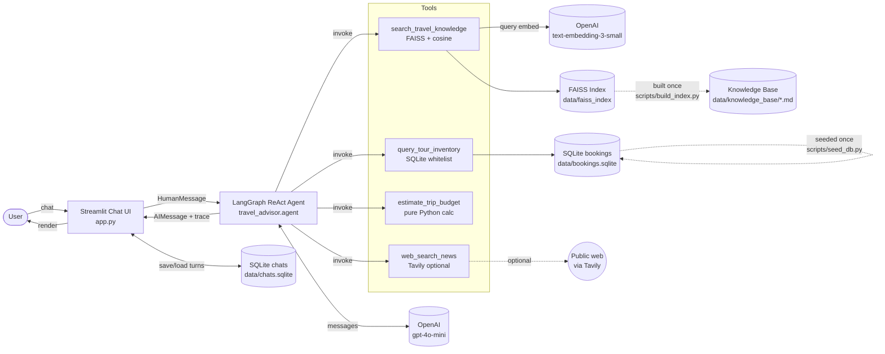
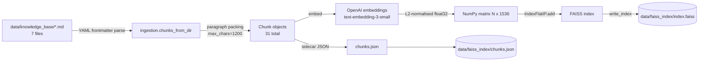
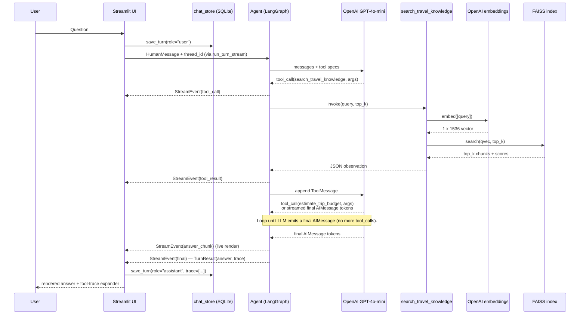
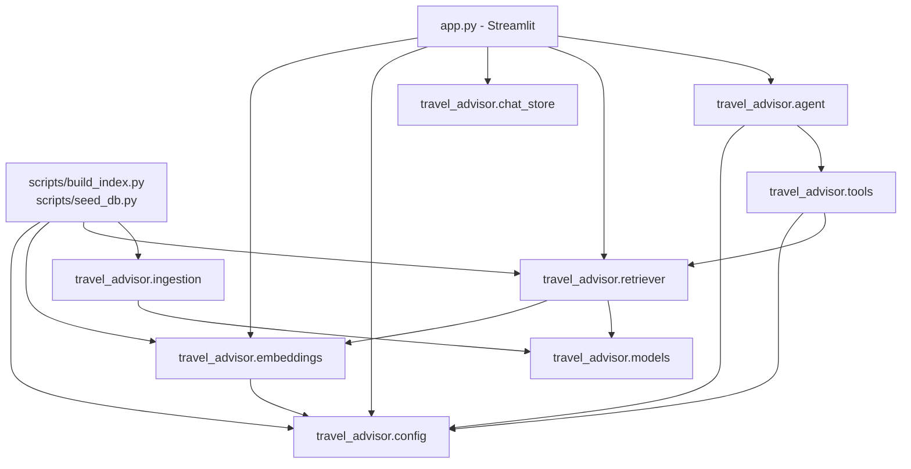

# System Architecture

## 1. High-level component diagram



## 2. RAG ingestion pipeline (one-time)



Run with:

```bash
python scripts/build_index.py
```

## 3. RAG query pipeline (per turn)



## 4. Module dependency map



## 5. Why these choices

| Decision | Rationale |
| --- | --- |
| **FAISS (IndexFlatIP) over Chroma/Pinecone** | Smallest dependency surface. Persists to a single binary file + JSON sidecar. No external service to provision for a hackathon demo. Easy to swap later — the `Retriever` API is intentionally narrow. |
| **L2-normalised vectors + inner product** | Reduces cosine similarity to a single matrix multiply; FAISS doesn't have a dedicated cosine index but does have IP. |
| **YAML front-matter markdown KB** | Plain-text, version-control friendly, lets us pack multiple docs in one file for editorial readability. Tiny custom parser (no PyYAML) keeps deps light. |
| **Parameterised SQLite tool (not SQLDatabaseToolkit)** | Zero SQL-injection surface. LLM picks filters from a documented schema; we generate the SQL ourselves with `?` placeholders. Trade-off: less expressive than raw SQL, more secure and predictable. |
| **`estimate_trip_budget` as a dedicated tool** | Forces the LLM to compute totals deterministically (vs hallucinating arithmetic) and surfaces the breakdown to the user. |
| **LangGraph `create_react_agent` + `MemorySaver`** | Mature pattern from coursework (assignment-13/14); supports multi-tool routing and multi-turn memory with one helper. |
| **Token-level streaming via `run_turn_stream`** | LangGraph's multi-mode `.stream(stream_mode=["updates", "messages"])` surfaces both tool-call events (`updates`) and per-token answer chunks (`messages`), so the UI can render live tool status + streaming text without polling. |
| **SQLite chat persistence (`chat_store`)** | Threads + per-turn tool traces survive process restarts. Each thread id is propagated through the URL (`?t=<uuid>`) so reloads and shared links restore the same conversation. Lightweight (one file, no service). |
| **Streamlit (not React)** | Single-process Python deployment matches the hackathon's "localhost" deployment story. ~450 LOC for a working chat UI with citations, streaming, persistence, and thread sidebar. |
| **HashingEmbedder for tests** | Deterministic, no API key, < 1s test runtime. Enables CI-friendly tests. |

## 6. API specification (agent tool contracts)

Each tool exposes a JSON-schema contract to the LLM via its `@tool` docstring. See [tools.py](../travel_advisor/tools.py) for the source of truth; below is the abbreviated form.

### `search_travel_knowledge`

```json
{
  "query": "string (required, free text)",
  "top_k": "integer (default 4)",
  "region": "enum: north | central | south | nationwide | null"
}
```

Returns:

```json
{
  "count": "int",
  "results": [
    {"doc_id": "str", "title": "str", "source_file": "str",
     "score": "float", "snippet": "str", "tags": ["..."], "region": "str"}
  ]
}
```

### `query_tour_inventory`

```json
{
  "table": "enum: tours | hotels | flights (required)",
  "filters": "object (see schema in docstring)",
  "limit": "integer 1-25 (default 5)"
}
```

Returns: `{count, results, sql, filters}` or `{error, allowed}`.

### `estimate_trip_budget`

```json
{
  "nights_hotel": "int (required, >=0)",
  "hotel_price_per_night_vnd": "int (required, >=0)",
  "flights_total_vnd": "int (default 0)",
  "tours_total_vnd": "int (default 0)",
  "daily_food_vnd": "int (default 400000)",
  "daily_transport_vnd": "int (default 200000)",
  "travellers": "int (default 1, >=1)",
  "contingency_pct": "int (default 10)"
}
```

Returns: per-line subtotals, grand total, per-person breakdown, USD conversion at VND_PER_USD = 25,500.

### `web_search_news`

```json
{
  "query": "string (required)",
  "max_results": "integer 1-10 (default 3)"
}
```

Returns: `{mode: "live"|"offline", count, results: [{title, url, snippet, published_at?}], note?}`.
